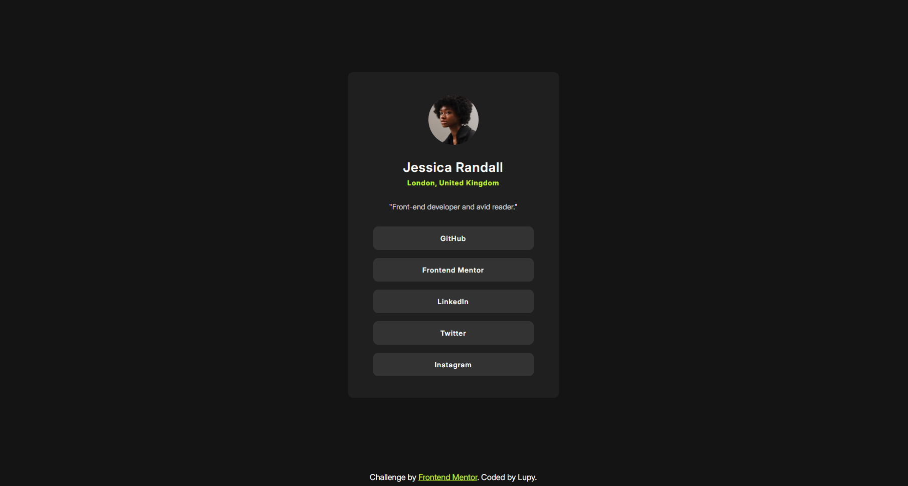

<h1 align="center"> FrontendMentor </h1>

 

  

## 🚀 Tecnologias

Esse projeto foi desenvolvido com as seguintes tecnologias:

- HTML e CSS
- Git e Github

## 💻 Projeto

Uma preview de um cartão de um blog

- [Para ver no site](https://lupyeah.github.io/Social-links/)

## 📋 Funcionalidades

- 📌 Uma página com informações sobre a pessoa
- ❗ Botões para mandar a pessoa no link
---

Feito pela Lupy com ajuda do Frontend
